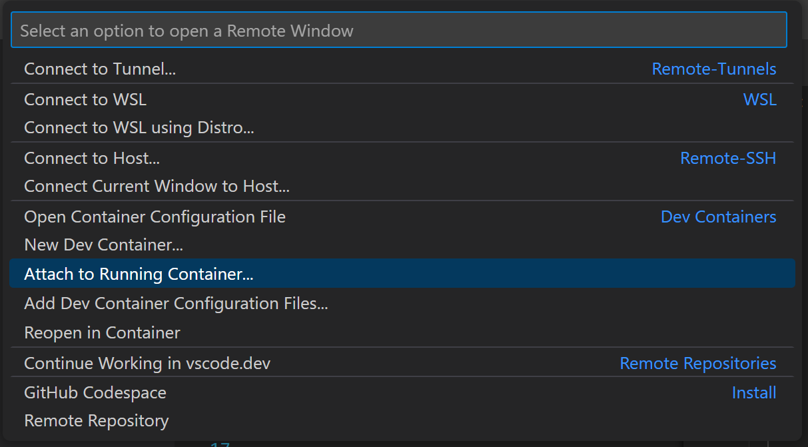

# Docker builder for DeepLSD

## Usage

```bash
# Pull the latest image
docker pull ghcr.io/jiu-xiao/deeplsd-docker:main

# Run with gpu
docker run -it --gpus all ghcr.io/jiu-xiao/deeplsd-docker:main

# Install afm
~/afm_install.sh
......
```

## Use vscode attached to docker



## Open DeepLSD in vscode

path: `/DeepLSD`

## Open Jupyter in vscode

path: `/DeepLSD/notebooks`

select `Python 3.8`
